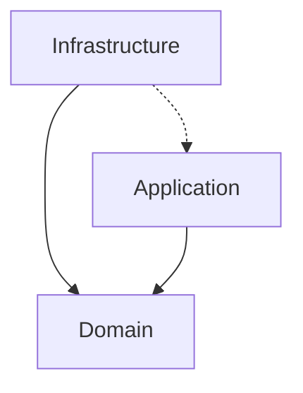

# FC-DDD-PATTERNS

A Domain-Driven Design implementation demonstrating clean architecture patterns with TypeScript

## 🎯 Purpose

This repository serves as a reference implementation of Domain-Driven Design (DDD) concepts with:

- Clear separation of domain/business logic from infrastructure concerns
- Implementation of core DDD building blocks (Entities, Value Objects, Aggregates, Repositories)
- Event-driven architecture using domain events
- Hexagonal/Clean Architecture principles
- SOLID design principles

## 🏗️ DDD Implementation

### Key Domain Elements

- **Aggregates**
  - `Customer`, `Product`, `Order` as root aggregates
  - `OrderItem` as entity within Order aggregate
- **Value Objects**
  - `Address` with validation logic
  - Money pattern through Product pricing
- **Repositories**
  - `CustomerRepository`
  - `ProductRepository`
  - `OrderRepository`
- **Domain Events**
  - `CustomerCreatedEvent`
  - `ProductCreatedEvent`
  - `CustomerAddressChangedEvent`
- **Domain Services**
  - `OrderService` with domain-specific operations
  - `ProductService` for price calculations
- **Factories**
  - `CustomerFactory`
  - `ProductFactory`
  - `OrderFactory`

## 🧱 Architecture Layers

### 1. Domain Layer

- **Location**: `src/domain/`
- Contains pure business logic:
  - Entities (`customer/entity/customer.ts`)
  - Value Objects (`customer/value-object/address.ts`)
  - Domain Events (`product/event/product-created.event.ts`)
  - Interfaces/Contracts (`@shared/repository/repository-interface.ts`)

### 2. Application Layer

- **Location**: Implicit in service implementations
- Coordinates domain objects and infrastructure:
  - Service implementations (`checkout/service/order.service.ts`)
  - Event handlers (`product/event/handler/...`)

### 3. Infrastructure Layer

- **Location**: `src/infrastructure/`
- Implements technical details:
  - Database repositories (`customer/repository/sequelize/`)
  - ORM models (`customer.model.ts`)
  - Event dispatcher implementation
- Depends on domain interfaces

PS: Or you can just think it in ports and adapters, so domain are the ports and infrastructure are the adapters. And our services connect the domain and infrastructure.

## ↔️ Layer Communication



- **Domain Layer** is completely isolated with:
  - No external dependencies
  - All contracts defined through interfaces
- **Infrastructure** implements domain interfaces:

  ```typescript
  // Domain interface
  export interface ProductRepositoryInterface extends RepositoryInterface<Product> {}

  // Infrastructure implementation
  export class ProductRepository implements ProductRepositoryInterface {
    // Sequelize-specific implementation
  }
  ```

- **Application Services** coordinate between layers:
  ```typescript
  class OrderService {
    static placeOrder(customer: Customer, items: OrderItem[]): Order {
      // Uses domain objects
      const order = new Order(uuid(), customer.id, items);
      // Updates domain entity
      customer.addRewardPoints(order.total() / 2);
      return order;
    }
  }
  ```

## 🚀 Key Features

### Event-Driven Architecture

```typescript
// 1. Create event dispatcher
const dispatcher = new EventDispatcher();
// 2. Register handlers
dispatcher.register("ProductCreatedEvent",
new SendEmailWhenProductIsCreatedHandler());
// 3. Trigger event
const product = ProductFactory.create(...);
dispatcher.notify(new ProductCreatedEvent(product));
```

### Repository Pattern

```typescript
// Domain interface
interface CustomerRepositoryInterface {
  find(id: string): Promise<Customer>;
  // ...
}
// Infrastructure implementation
class CustomerRepository implements CustomerRepositoryInterface {
  async find(id: string): Promise<Customer> {
    // Sequelize implementation
    const model = await CustomerModel.findByPk(id);
    return new Customer(model.id, model.name);
  }
}
```

## 🛠️ Technologies

- **Core**
  - TypeScript
  - Sequelize (ORM)
  - SQLite (Database)
- **Testing**
  - Jest
  - SWC
- **Patterns**
  - Domain Events
  - Factory Pattern
  - Repository Pattern
  - Unit of Work

## 🔑 Key domains

- Customer management
- Product catalog
- Order processing
- Event-driven workflows

## 📚 Learning Resources

This implementation demonstrates patterns from:

- Eric Evans' "Domain-Driven Design"
- Vaughn Vernon's "Implementing Domain-Driven Design"
- Clean Architecture/Hexagonal Architecture principles
- Event Storming concepts
